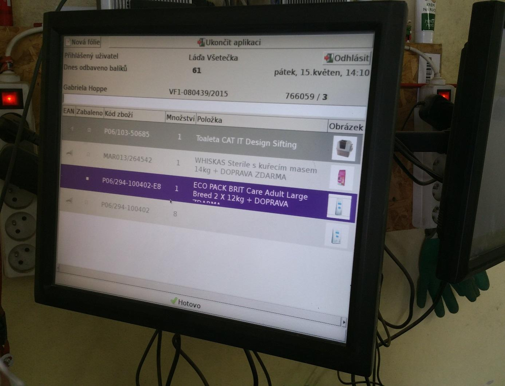
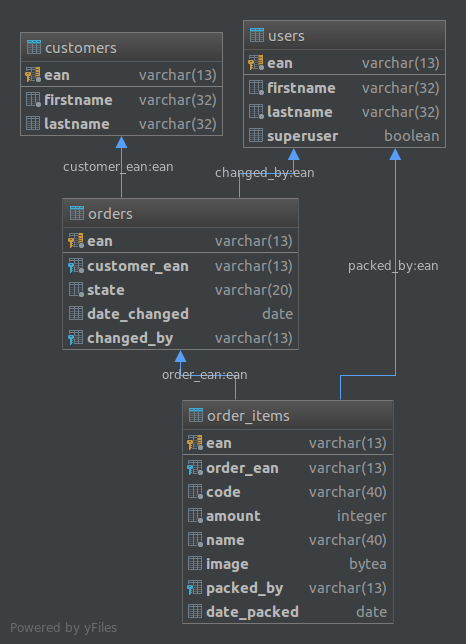

# Zadání testovacího projektu
- Úkolem je si vyzkoušet vývoj full-stack aplikace, tedy frontend, backend a databázovou část
- Zadání je spíše volnějšího rázu, lze si vymyslet, přidat nebo změnit cokoliv

## Osnova
Jedná se o aplikaci na zpracování (expedici) objednávek.

**Situace:** Expedient je ve skladu a balí objednávku. Vezme papír s vytištěnou objednávkou a sejme její čarový EAN kód.
V aplikaci uvidí seznam položek, které musí zabalit. Bere je tedy postupně do ruky, "odpípne" je čtečkou kódů a dá do balíku.
Až zabalí všechny, objednávku uzavře.

1. Uživatel, který je identifikován svým EAN kódem, se nejprve přihlásí do aplikace
   - Informace o přihlášeném uživateli budou od této doby zobrazené v horní části obrazovky (viz [doc/example.jpg](doc/example.jpg)) 
2. Uživatel napíše (zadá čtečkou kódů) do vyhledávacího pole EAN kód objednávky
   - Načtou se položky objednávky a zobrazí se v seznamu (viz [doc/example.jpg](doc/example.jpg))
3. Do vyhledávacího pole bude nyní uživatel zadávat EAN kód jednotlivých položek v objednávce.
   - Pokud se jedná o položku, jejíž množství je vyšší než 1, zobrazí se číselník, kde se musí zadat počet položek, které se ve 
   skutečnosti balí 
     - Situace: Mám v objednávce položku A s množstvím 2. V ruce mám však jen jednu položku A. Číselníkem 
   tak potvrdím, že jsem zatím zabalil pouze 1 položku A, tím pádem ještě 1 zbývá
4. Po zabalení všech položek se tlačítkem uzavře objednávka. U položek a u objednávky se uloží, který uživatel je expedoval.
   - Pokud má uživatel speciální oprávnění (sloupec *superuser* v databázi), může ukončit nekompletní objednávku

Následující ukázka je __pouze ilustrativní__, není nutné přesně kopírovat design.

## Databáze
- Databáze je PostgreSQL. Reálnou konfiguraci připojení, která se necommituje do gitu, __je třeba vytvořit__. V [server/config/db-config.example.ts](server/config/db-config.example.ts) je ukázková konfigurace. Tento soubor je nutné zkopírovat do stejného adresáře, vyplnit reálnou konfiguraci a přejmenovat jej na __db-config.ts__. Ten je zapsán v [.gitignore](.gitignore) a nebude tudíž verzován.

- Na následujícím obrázku je znázorněno schéma databáze:

- Tabulky jsou vytvořeny, ale nejsou v nich (pravděpodobně) žádná data. Je proto třeba mít nějaký database-browser (třeba PgAdmin 4), připojit se k databázi a nějaká data si tam vložit.

## Instalace

Stačí si forknout a naklonovat tento repozitář a spustit `npm install`. Je nutné mít alespoň __Node 10__.

## Vývoj

Spuštěním npm skriptu `npm run watch:all` se spustí kompilace backendu a frontendu a poté by se mělo otevřít okno v prohlížeči. Pokud se npm skript nepodaří spustit, tak je třeba se podívat do souboru [scripts/watch.sh](scripts/watch.sh), který se npm skriptem spouští. Pod linuxem by to mělo fungovat hned, na windowsech možná ne - v tom případě by bylo asi nejlepší mít na windowsech Bash (Cygwin) a nebo to dělat ve virtuálu na linuxu.

Pokud watch proces proběhne v pořádku, ale okno v prohlížeči se neotevře, tak by se mělo dát ručně otevřít navigací na adresu [localhost:4200](localhost:4200). Poté už lze psát kód. Při změně a uložení kódu z frontendu se okno prohlížeče automaticky refreshne.

Spuštěním npm skriptu `npm run build:all:prod` se spustí produkční AOT build. Ten není pro tuto úlohu příliš podstatný, ale dá se jím zkontrolovat, jestli je kód dobře napsaný pro produkční build.

Pro přidávání nových Angular komponent (serviců, direktiv, atd.) je vhodné použít [angular-cli](https://cli.angular.io/) - viz příkaz `ng generate`.

Soubory s testy jsou sice v tomto projektu zahrnuty, ale v této úloze je není nutné psát.
